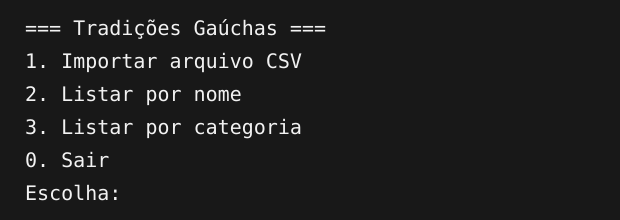
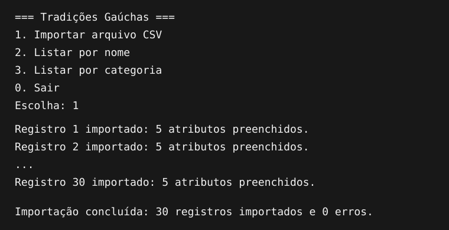
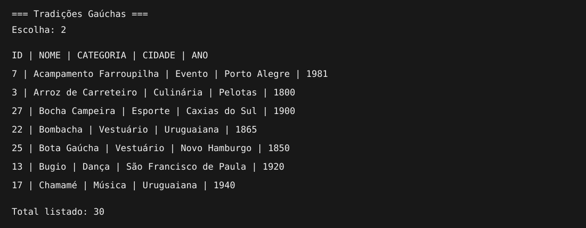
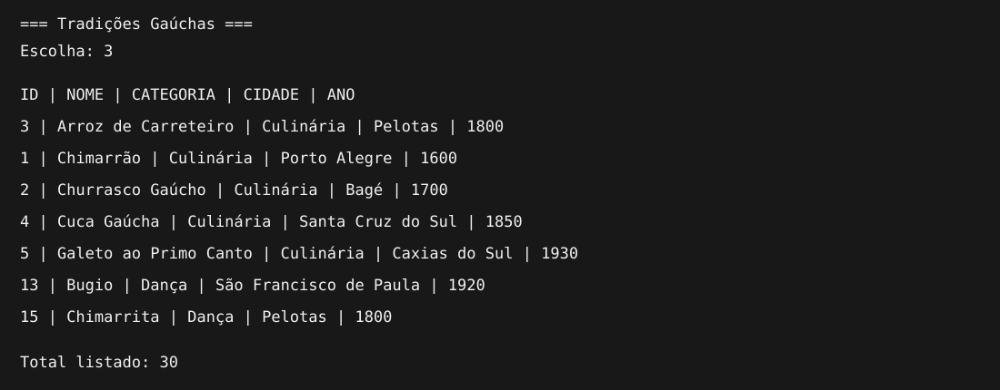

# Tradições Gaúchas

Projeto acadêmico desenvolvido em Java para importar dados de um arquivo CSV
e armazená-los em um banco de dados SQLite usando JDBC.



## Funcionalidades

- Importação de 30 tradições gaúchas do arquivo `tradicoes.csv`.
- Exibição da quantidade de atributos preenchidos em cada registro.
- Armazenamento dos dados no banco SQLite `tradicoes.db`.
- Listagem dos registros ordenados por nome.
- Listagem dos registros ordenados por categoria.
- Tratamento de erros de leitura, conversão e banco de dados.

## Dados utilizados

Cada tradição possui os seguintes atributos:

| Campo | Descrição |
|---|---|
| `id` | Identificador único |
| `nome` | Nome da tradição |
| `categoria` | Culinária, dança, esporte, evento, música ou vestuário |
| `cidade` | Cidade relacionada à tradição |
| `ano_origem` | Ano aproximado de origem |

## Requisitos

- Java JDK 11 ou superior.
- Apache Maven 3.8 ou superior.
- Visual Studio Code com a extensão **Extension Pack for Java**.
- Extensão **SQLite Viewer**, opcional, para visualizar o banco.

As dependências Java, incluindo o driver JDBC do SQLite, são configuradas no
arquivo `pom.xml` e baixadas automaticamente pelo Maven.

## Como executar no VS Code

1. Extraia o arquivo ZIP do projeto.
2. Abra o Visual Studio Code.
3. Instale a extensão **Extension Pack for Java**, publicada pela Microsoft.
4. Clique em **Arquivo > Abrir Pasta** e selecione `projeto-tradicao-gaucha`.
5. Aguarde o VS Code carregar o projeto Maven.
6. Abra `src/main/java/com/example/Main.java`.
7. Clique em **Run** acima do método `main`.
8. Digite uma opção no terminal e pressione `Enter`.

Também é possível executar pelo terminal aberto na pasta do projeto:

```bash
mvn compile
mvn exec:java
```

> O programa deve ser executado a partir da pasta principal do projeto, pois
> nela está o arquivo `tradicoes.csv`.

## Opções do menu

### 1. Importar arquivo CSV

Lê o arquivo `tradicoes.csv`, transforma cada linha em um objeto
`TradicaoGaucha` e grava os registros no SQLite. O arquivo `tradicoes.db` é
criado automaticamente na primeira execução.



Executar a importação novamente atualiza os registros existentes, pois o campo
`id` identifica cada tradição.

### 2. Listar por nome

Mostra todos os registros em ordem alfabética pelo nome da tradição.



### 3. Listar por categoria

Agrupa os registros por categoria e ordena os nomes dentro de cada categoria.



## Como visualizar o banco SQLite

1. Execute a opção `1` do programa para criar e preencher `tradicoes.db`.
2. No VS Code, abra a aba **Extensões** com `Ctrl + Shift + X`.
3. Pesquise por **SQLite Viewer**.
4. Instale a extensão SQLite Viewer.
5. No explorador de arquivos do VS Code, clique em `tradicoes.db`.
6. Abra a tabela `tradicao_gaucha` para visualizar os 30 registros.

O SQLite Viewer é utilizado apenas para consultar o banco visualmente. A
criação da tabela, a inserção e as listagens são realizadas pelo código Java.

## Organização do projeto

```text
projeto-tradicao-gaucha/
├── src/main/java/com/example/
│   ├── Main.java
│   ├── TradicaoGaucha.java
│   ├── LeitorCsv.java
│   ├── TradicaoGauchaMapper.java
│   ├── TradicaoGauchaDAO.java
│   └── ImportacaoService.java
├── imagens/
├── logs/
├── tradicoes.csv
├── pom.xml
└── README.md
```

| Classe | Responsabilidade |
|---|---|
| `Main` | Exibe o menu e recebe a opção do usuário |
| `TradicaoGaucha` | Representa a entidade e possui construtores progressivos |
| `LeitorCsv` | Lê o arquivo CSV usando UTF-8 |
| `TradicaoGauchaMapper` | Converte uma linha do CSV em objeto |
| `TradicaoGauchaDAO` | Cria a tabela, insere e consulta usando JDBC |
| `ImportacaoService` | Coordena leitura, mapeamento e inserção |

## Exceções e recursos

- `IOException`: trata problemas durante a leitura do CSV.
- `NumberFormatException`: trata valores numéricos inválidos.
- `SQLException`: trata problemas de acesso ao SQLite.
- `try-with-resources`: fecha automaticamente arquivo, conexão, comandos SQL,
  resultados de consultas e teclado.

## Resultado esperado

Após escolher a opção `1`, o programa deve informar:

```text
Importação concluída: 30 registros importados e 0 erros.
```
