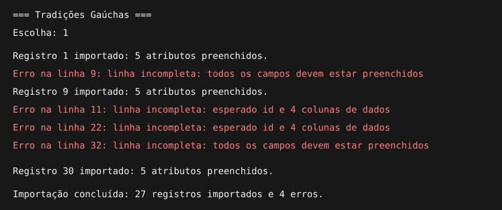

# Tradições Gaúchas

Projeto acadêmico desenvolvido em Java para importar dados de um arquivo CSV
e armazená-los em um banco de dados SQLite usando JDBC.


## Funcionalidades

- Leitura das tradições gaúchas presentes no arquivo `tradicoes.csv`.
- Validação das colunas e dos campos de cada registro.
- Exibição da quantidade de atributos preenchidos.
- Armazenamento dos registros válidos no banco SQLite.
- Listagem dos registros ordenados por nome ou categoria.
- Linhas inválidas são informadas, ignoradas e não são salvas.

## Dados utilizados

Cada tradição possui os seguintes atributos:

| Campo | Descrição |
|---|---|
| `id` | Identificador único |
| `nome` | Nome da tradição |
| `categoria` | Categoria da tradição |
| `cidade` | Cidade relacionada à tradição |
| `ano_origem` | Ano aproximado de origem |

## Requisitos

- Java JDK 11 ou superior.
- Apache Maven 3.8 ou superior.
- Visual Studio Code com a extensão **Extension Pack for Java**.
- Extensão **SQLite Viewer**, opcional, para visualizar o banco.

As dependências Java, incluindo o driver JDBC do SQLite, são configuradas no
arquivo `pom.xml` e baixadas automaticamente pelo Maven.

## Como executar no VS Code

1. Extraia o arquivo ZIP.
2. Abra o Visual Studio Code.
3. Instale a extensão **Extension Pack for Java**, da Microsoft.
4. Clique em **Arquivo > Abrir Pasta** e selecione `projeto-tradicao-gaucha`.
5. Aguarde o VS Code carregar o projeto Maven.
6. Abra `src/main/java/com/example/Main.java`.
7. Clique em **Run** acima do método `main`.
8. Digite uma opção no terminal e pressione `Enter`.

Também é possível executar pelo terminal:

```bash
mvn compile
mvn exec:java
```

> Execute o programa a partir da pasta principal do projeto, pois nela está o
> arquivo `tradicoes.csv`.

## Opções do menu

### 1. Importar arquivo CSV

Lê o arquivo `tradicoes.csv`, transforma as linhas válidas em objetos
`TradicaoGaucha` e grava os registros no SQLite.

O arquivo `tradicoes.db` é criado automaticamente na primeira execução.


### Tratamento de linhas com erro

Cada linha deve possuir exatamente cinco campos preenchidos:

```text
id;nome;categoria;cidade;ano_origem
```

O `TradicaoGauchaMapper` verifica a quantidade de campos e se todos estão
preenchidos antes de criar o objeto.

Exemplos de linhas inválidas:

```csv
10;Rodeio Crioulo;1958
;Vestuário;Porto Alegre;1800
;;;;
```

Quando uma linha está incompleta, o programa mostra o número da linha, ignora
o registro e continua processando as próximas linhas. O registro inválido não
é enviado ao DAO e não é salvo no banco de dados.



Exemplo de saída:

```text
Erro na linha 11: linha incompleta: esperado id e 4 colunas de dados
Erro na linha 32: linha incompleta: todos os campos devem estar preenchidos

Importação concluída: 27 registros importados e 4 erros.
```

### 2. Listar por nome

Mostra todos os registros válidos em ordem alfabética pelo nome.


### 3. Listar por categoria

Agrupa os registros válidos por categoria e ordena seus nomes.


## Como visualizar o banco SQLite

1. Execute a opção `1` para criar e preencher `tradicoes.db`.
2. No VS Code, abra a aba **Extensões** com `Ctrl + Shift + X`.
3. Pesquise por **SQLite Viewer**.
4. Instale a extensão.
5. No explorador de arquivos, clique em `tradicoes.db`.
6. Abra a tabela `tradicao_gaucha`.

O SQLite Viewer é utilizado apenas para consultar o banco visualmente. A
criação da tabela, inserção e listagens são realizadas pelo código Java.

## Organização do projeto

```text
projeto-tradicao-gaucha/
├── src/main/java/com/example/
│   ├── Main.java
│   ├── TradicaoGaucha.java
│   ├── LeitorCsv.java
│   ├── TradicaoGauchaMapper.java
│   ├── TradicaoGauchaDAO.java
│   └── ImportacaoService.java
├── imagens/
├── tradicoes.csv
├── pom.xml
└── README.md
```

| Classe | Responsabilidade |
|---|---|
| `Main` | Exibe o menu e recebe a opção do usuário |
| `TradicaoGaucha` | Representa a entidade e possui construtores progressivos |
| `LeitorCsv` | Lê o arquivo CSV usando UTF-8 |
| `TradicaoGauchaMapper` | Valida e converte uma linha do CSV em objeto |
| `TradicaoGauchaDAO` | Cria a tabela, insere e consulta usando JDBC |
| `ImportacaoService` | Coordena leitura, mapeamento e inserção |

## Exceções e recursos

- `IOException`: trata problemas durante a leitura do CSV.
- `NumberFormatException`: trata valores numéricos inválidos.
- `IllegalArgumentException`: trata linhas incompletas.
- `SQLException`: trata problemas de acesso ao SQLite.
- `try-with-resources`: fecha automaticamente os recursos utilizados.

## Resultado esperado

Com o CSV de exemplo atual, após escolher a opção `1`, o programa informa:

```text
Importação concluída: 27 registros importados e 4 erros.
```

Somente os 27 registros válidos são salvos no banco de dados.